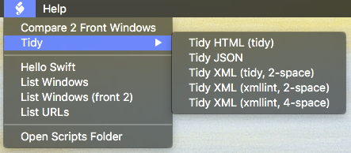

004.45macOS_CotEditorSwiftScripting
==============================
[t]:http://www.github.com

This repository contains scripts for the [CotEditor](https://coteditor.com/) plain text editor for MacOS.  These scripts are `Swift` based.



_Advisory: These scripts can modify content of the front window. Undo should restore the window to it's previous state.  Read the scripts. Modify them for your use. Use at you own risk. These scripts are provided "as-is" (see [LICENSE](LICENSE.txt))._

<a id="toc"></a>
[Prerequisites](#Prerequisites) | [Scripts](#Scripts) | [Resources](Resources)  

<a id="Prerequisites"></a>
Prerequisites [▴](#toc)
-------

* CotEditor: 
    * installed
    * familiar with CotEditor Unix script install and use instructions  
* Swift 3
* Meld: can be downloaded at [meldmerge.org/](http://meldmerge.org/).
* `tidy`: can be installed with [MacPorts](https://github.com/macports/macports-ports/blob/master/www/tidy/Portfile).  See [http://www.html-tidy.org/](http://www.html-tidy.org/) for more information and install options.

    ``` sh
    sudo port install tidy
    ```

* `xmllint`: Unix CLI tools. Maybe already installed on the system.  If not, install Xcode command line tools.

    ``` sh
    # check installation
    which -a xmllint
    xmllint  --version
    ```

_The scripts were developed on macOS Sierra 10.12 with Swift 3.0.2.  The scripts might not run on older versions._

<a id="Scripts"></a>
Scripts [▴](#toc)
-------

The Swift scripts are written using a copy & paste subset of the CotEditor.swift and CotEditorScripting.swift in the "templates/" folder. (Each script only needs some part of the definitions.) The CotEditor.swift and CotEditorScripting.swift files were generated based on an approach explained by [Tony Ingraldi](https://github.com/tingraldi/SwiftScripting).  The files in the "templates/ObjC Header/" are intermediates used to generate CotEditor.swift and CotEditorScripting.swift.

**Hello Swift (example & test script)**

"Hello Swift" provides a `#!/usr/bin/swift` Unix script example for the CotEditor. "Hello Swift" prints (inserts) information about the Swift scripting environment as seen by a CotEditor Unix script.

A run of `Hello Swift` will also be a test of if your environment can run the Swift Unix Scripts.

**Compare 2 Front Windows (with Meld)** 

The script `Compare 2 Front Window` requies that [Meld](http://meldmerge.org/) be install on the system.  Both front windows are checked to make sure any content changes have been saved. The script write errors to the clipboard.

``` swift
// standard Meld installation path to CLI tool
let commandPath = "/Applications/Meld.app/Contents/MacOS/Meld"
``` 

**Tidy (pretty print)**

The Tidy scripts will "pretty print" the entire `HTML`, `JSON` or `XML` window document.  

_Tidy HTML (tidy)_ and _Tidy XML (tidy, 2-space)_ use `tidy`. The _Tidy HTML_ script adds a comment section at the end of any warnings. The _Tidy XML (xmllint, 2-space)_ and _Tidy XML (xmllint, 4-space)_ use `xmllint`.

_Tidy JSON_ uses Swift Foundation without calling any external Unix tools or applications. 

**List (windows & URLs)**

The `List` scripts show examples for accessing windows and documents.

<a id="Resources"></a>
Resources [▴](#toc)
---------

* [GitHub/tingraldi: SwiftScripting ⇗](https://github.com/tingraldi/SwiftScripting) - explain Swift scripting technical approach 
* [MacPorts](https://www.macports.org/) - open-source community initiative for compiling, installing, and upgrading various open-source software
* [Meld](http://meldmerge.org/) - a visual diff and merge tool
* [`tidy`](http://www.html-tidy.org/) - "The granddaddy of HTML tools"


License
-------

The source code is PROVIDED "AS IS", WITHOUT WARRANTY OF ANY KIND under the terms of the MIT License. See the bundled [LICENSE](LICENSE.txt) for details.

  
